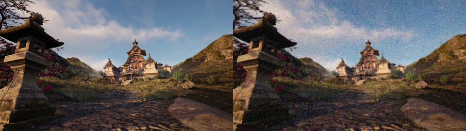

# Super Resolution Gaming Benchmark (SRGB)

### <div align="center"><b><a href="README.md">English</a> | <a href="README_RU.md">Русский</a></b></div>

<p align="center">
    
</p>

<div align="center">

[](https://github.com/pe4eniks/SRGB/releases)
[](https://github.com/pe4eniks/SRGB/issues)
[](https://github.com/pe4eniks/SRGB/issues)
[](https://github.com/Pe4enIks/SRGB/blob/main/LICENSE)

</div>

## Kaggle
A [competition](https://www.kaggle.com/competitions/super-resolution-in-video-games) based on the SRGB dataset has been launched on the Kaggle platform and will run until August 31, 2024. The SRGB dataset will be publicly available on Huggingface after the competition ends. More information is available on the [wiki](https://github.com/Pe4enIks/SRGB/wiki/Kaggle-competition).


## Bibtex
```bibtex
@misc{srgb,
    author = {Evgenii Pishchik},
    title = {Super Resolution Gaming Benchmark},
    year = {2024},
    url = {https://github.com/Pe4enIks/SRGB}
}
```
