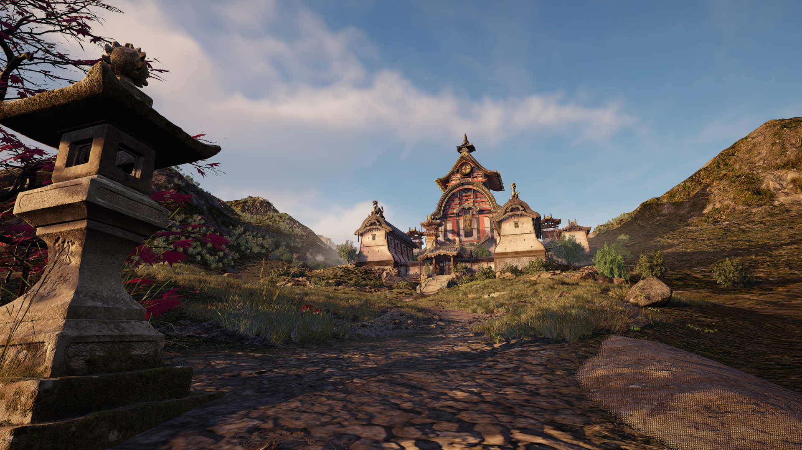

# Super Resolution Gaming Dataset (SRGD)

|                     LR                     |                     HR                     |
|:------------------------------------------:|:------------------------------------------:|
|  |  |

<div align="center">

[](https://github.com/pe4eniks/SRGB/releases)
[](https://github.com/pe4eniks/SRGB/issues)
[](https://github.com/pe4eniks/SRGB/issues)
[](https://github.com/Pe4enIks/SRGB/blob/main/LICENSE)

</div>

## Description

[Image Super Resolution](https://paperswithcode.com/task/image-super-resolution) is a machine learning task where the goal is to increase the resolution of an image, often by a factor of 4x or more, while maintaining its content and details as much as possible. The end result is a high resolution version of the original image. This task can be used for various applications such as improving image quality, enhancing visual detail, and increasing the accuracy of computer vision algorithms.

Video games require a lot of computing resources such as GPU, CPU, RAM, etc. To reduce the computing cost, some companies such as [NVIDIA](https://www.nvidia.com/en-us/), [AMD](https://www.amd.com/en.html) create their own solutions based on super resolution technologies. This is because it may be faster to render at a lower resolution and then upscale the image than to just render at high resolution.

We've collected a dataset mostly using the [Unreal Engine](https://www.unrealengine.com/en-US) game engine. There aren't a lot of datasets for super resolution in games, so we hope that the collected dataset will give independent developers more room to get started in this area.

## Documentation
Each part described below, and others such as the setup process, has a short overview on the [README](https://github.com/Pe4enIks/SRGB/blob/main/README.md) page, for more information see the [wiki](https://github.com/Pe4enIks/SRGB/wiki) page.

## Dataset
Dataset was collected using [Unreal Engine](https://www.unrealengine.com/en-US) and consists of 2 independent datasets, each dataset has all images in 4 different resolutions - 270p, 360p, 540p, 1080p:
- GameEngineData: 14431 train and 3600 test images.
- DownscaleData: 29726 train and 7421 test images.

## Models
|Name|Link|Type|Config|PSNR*|SSIM*|LPIPS*|
|:--:|:--:|:--:|:----:|:---:|:---:|:-----|
|Real-ESRGAN|[xinntao/Real-ESRGAN](https://github.com/xinntao/Real-ESRGAN)|GAN|[RealESRGAN_x4plus](https://github.com/Pe4enIks/SRGB/blob/main/configs/model/pretrained/RealESRGAN_x4plus.yaml)|23.5409|0.7992|0.3924|
|EMT|[Fried-Rice-Lab/EMT](https://github.com/Fried-Rice-Lab/EMT)|Transformer|[EMT_x4](https://github.com/Pe4enIks/SRGB/blob/main/configs/model/pretrained/EMT_x4.yaml)|24.5443|0.8231|0.3889|
|ResShift|[zsyOAOA/ResShift](https://github.com/zsyOAOA/ResShift)|Diffusion|[ResShift_RealSRx4](https://github.com/Pe4enIks/SRGB/blob/main/configs/model/pretrained/ResShift_RealSRx4.yaml)|23.0368|0.7992|0.4829|

\* - metric was calculated using pretrained versions** of the models on the GameEngineData dataset with x4 scaling from 270p to 1080p.

\** - the config field specifies the exact version of the model which was used to calculate metric.

## Kaggle
A [competition](https://www.kaggle.com/competitions/super-resolution-in-video-games) based on the SRGD dataset has been launched on the Kaggle platform and will run until August 26, 2024. **The SRGD dataset will be publicly available on Huggingface after the competition ends**.


## Bibtex
```bibtex
@misc{srgd,
    author = {Evgenii Pishchik},
    title = {Super Resolution Gaming Dataset},
    year = {2023},
    url = {https://github.com/Pe4enIks/SRGD}
}
```
